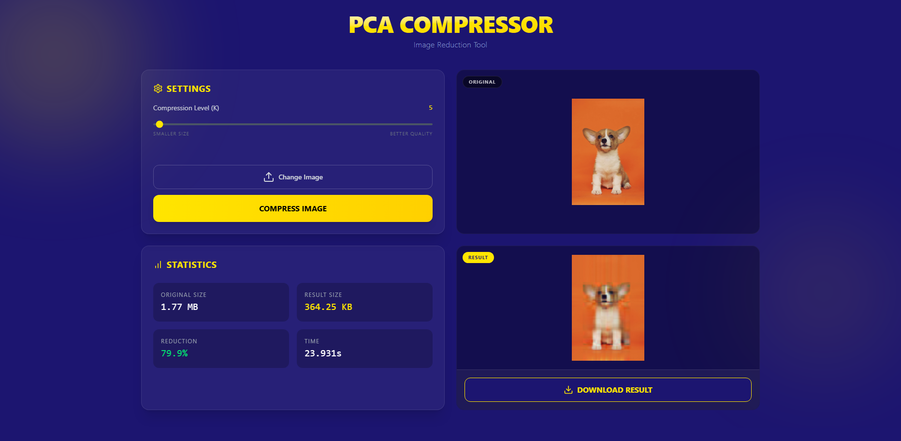

# 🖼️ PCA Image Compression

A web application that compresses images using **Principal Component Analysis (PCA)**. Upload any image, choose the number of principal components (k), and instantly see how PCA reconstructs the image with reduced data — a visual and interactive way to understand dimensionality reduction.

<p align="center">
  
</p>

## 🧠 How It Works

PCA (Principal Component Analysis) is a linear algebra technique that identifies the directions of maximum variance in data. When applied to images:

1. Each **color channel** (R, G, B) is treated as a separate matrix
2. The **covariance matrix** is computed and its eigenvectors are extracted
3. Only the top **k eigenvectors** (principal components) are kept
4. The image is **reconstructed** from this reduced representation

Lower `k` → more compression, less detail. Higher `k` → less compression, more detail.

### 📊 Compression Examples

| k = 5 | k = 20 | k = 50 |
|:---:|:---:|:---:|
|  |  |  |

| k = 100 | k = 200 | Original |
|:---:|:---:|:---:|
|  |  |  |

## 🏗️ Tech Stack

| Layer | Technology |
|-------|-----------|
| **Frontend** | React.js, Vite, JSX |
| **Backend** | Python, FastAPI |
| **Image Processing** | NumPy, Pillow |
| **Containerization** | Docker |

## 🚀 Getting Started

### Prerequisites

- **Python 3.10+**
- **Node.js 18+**

### Backend

```bash
cd backend
pip install -r requirements.txt
uvicorn src.main:app --reload
```

The API will be available at http://localhost:8000

### Frontend

```bash
cd frontend
npm install
npm run dev
```

The app will be available at http://localhost:5173

### 📡 API Endpoints

| Method | Endpoint | Description |
|--------|----------|-------------|
| GET | /health | Health check |
| POST | /compress | Compress an image using PCA |

### POST /compress

| Parameter | Type | Default | Description |
|-----------|------|---------|-------------|
| file | UploadFile | required | Image file (JPEG, PNG, etc.) |
| k | int | 50 | Number of principal components (1–2000) |

**Response:** Compressed JPEG image  

## 📚 Documentation

[📄 Project Report (PDF)](docs/reports/report_1.pdf)  
[📊 Presentation Slides](docs/present.pptx)  
[📝 LaTeX Source](docs/reports/main.tex)  
### 📜 License  
Distributed under the MIT License. See [LICENSE](./LICENSE) for more information.

